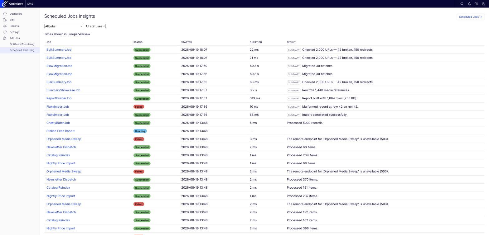
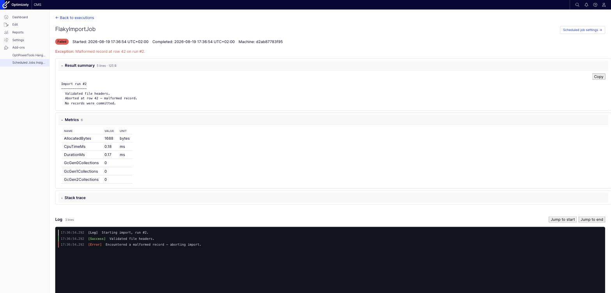
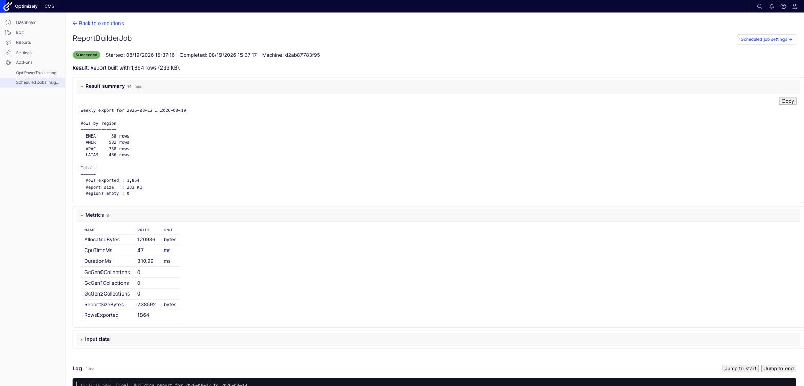
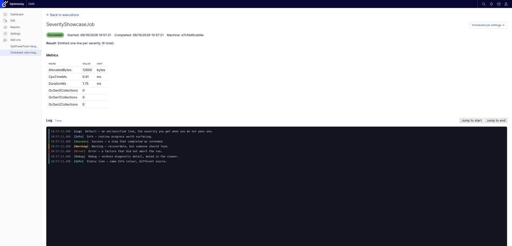

# OptiPowerTools.ScheduledJobsInsights

Structured logging, metrics, and a Blazor CMS UI for **native Optimizely CMS 13 scheduled jobs**. Extends `EPiServer.Scheduler.ScheduledJobBase` to persist every `OnStatusChanged` message, the job's return value, unhandled exceptions, execution metrics (duration, allocations, CPU time, GC counts), and anything you log explicitly — to EF Core-backed SQL tables, with a paginated/console-style Blazor viewer and an automatic retention cleanup job.

Part of the [OptiPowerTools](https://github.com/szolkowski) family — see also [OptiPowerTools.Hangfire](https://github.com/szolkowski/OptiPowerTools.Hangfire) if your background jobs run on Hangfire instead of (or alongside) Optimizely's native scheduler.

## Features

- One-liner DI bootstrap: `services.AddOptiPowerToolScheduledJobsInsights()`.
- `LoggedScheduledJobBase` — a drop-in replacement for `ScheduledJobBase` that captures execution history automatically.
- Per-run log lines with severity/color (`Default`/`Info`/`Success`/`Warning`/`Error`/`Debug`), plus a dedicated `LogInputData` call for capturing what a run started with.
- Automatic execution metrics (duration, allocated bytes, CPU time, GC generation counts) and a `RecordMetric` API for custom domain metrics.
- An optional per-run **result summary** — a multi-line report the job builds as it works, shown in its own collapsible section of the detail view, separate from the one-line message Optimizely shows in its admin grid.
- Paginated, filterable Blazor execution list and a console-style scrolling log viewer for a single run, embedded in the CMS shell like any native admin page.
- Menu entries in the CMS's own navigation — including one under **Settings › Data & Sync Management**, beside the native **Scheduled Jobs** page — and links from the UI across to a job's CMS settings.
- Automatic retention cleanup — itself a native `[ScheduledJob]`, visible and manageable in the CMS's own Scheduled Jobs admin list.
- Unhandled exceptions are never swallowed — native CMS admin's `HasLastExecutionFailed`/`LastExecutionMessage` tracking is completely unaffected.
- Cannot take your site down: if the insights database is unreachable, the application still starts, jobs still run, and `OnStatusChanged` still drives the CMS status column — only the history is lost, and it says so in the log.
- Configurable via `IOptions<T>` or `appsettings.json`.

## Screenshots

**Execution list** — filterable and keyset-paginated, with status badges, a **summary** marker on runs that recorded one, and a link across to the CMS's own Scheduled Jobs page:



**Execution detail** — result summary, metrics, input data and stack trace in collapsible sections, above a console-style log viewer with severity colouring, a line count and jump controls. Shown here for a failed run, whose summary survives the exception:



**Result summary** — a multi-line report the job builds as it works, newlines and alignment intact, with a copy button:



## Quick Start

### Required project setting

Add this to the application's `.csproj` before anything else:

```xml
<PropertyGroup>
  <RequiresAspNetWebAssets>true</RequiresAspNetWebAssets>
</PropertyGroup>
```

The UI is a Blazor Server component, so the application has to serve `_framework/blazor.server.js`.
That file comes from the `Microsoft.AspNetCore.App.Internal.Assets` pack, which the Web SDK
references only when the *application project itself* contains `.razor` files — this package's
components live in the package, so the SDK does not notice. Without the setting the page renders but
never becomes interactive, and the browser console shows a 404 for `blazor.server.js`.

This package cannot set it for you: NuGet resolves the implicit assets pack during restore, before a
package's MSBuild assets are imported, so the property only takes effect from the consuming project.
Applications that already contain their own `.razor` files get it automatically and can skip this.

### Wiring it up

```csharp
// Program.cs or Startup.cs
services.AddOptiPowerToolScheduledJobsInsights(options =>
{
    options.ConnectionString = Configuration.GetConnectionString("EPiServerDB");
});

// ... then in the middleware pipeline, after UseAuthorization()
// and BEFORE your own UseEndpoints(...) / MapXxx calls
app.UseOptiPowerToolScheduledJobsInsights();

app.UseEndpoints(endpoints =>
{
    endpoints.MapContent();
    endpoints.MapControllers();
});
```

Connection string can point to the same database as Optimizely or to a separate one — there is no fallback, it must be set explicitly.

> `UseOptiPowerToolScheduledJobsInsights()` applies pending migrations and maps the Blazor Server hub
> the UI connects over. Call it after `UseAuthorization()`; placing it ahead of your own
> `UseEndpoints(...)` keeps the hub registered alongside everything else. It deliberately does **not**
> call `MapControllers()` — your application already does, and mapping controllers from two separate
> `UseEndpoints(...)` blocks registers every action twice, which fails at request time with
> `AmbiguousMatchException`.

### Writing a logged job

Derive from `LoggedScheduledJobBase` and implement `ExecuteJob()` instead of the usual `Execute()`:

```csharp
using EPiServer.DataAbstraction;
using EPiServer.Scheduler;
using OptiPowerTools.ScheduledJobsInsights.Configuration;
using OptiPowerTools.ScheduledJobsInsights.Logging;

[ScheduledJob(DisplayName = "Nightly Catalog Sync", IntervalType = ScheduledIntervalType.Days)]
public class CatalogSyncJob : LoggedScheduledJobBase
{
    public CatalogSyncJob(IJobExecutionWriter writer, IScheduledJobRepository scheduledJobRepository)
        : base(writer, scheduledJobRepository)
    {
    }

    protected override string ExecuteJob()
    {
        LogInputData(new { Source = "ERP", Mode = "Incremental" });

        Log("Starting catalog sync.");
        // ... do the work, calling OnStatusChanged(...) as usual if you like ...
        Log("42 products updated, 1 skipped.", LogSeverity.Warning);

        RecordMetric("ProductsUpdated", 42);

        Summary.AppendSection("Totals");
        Summary.AppendLine("  Updated : 42");
        Summary.AppendLine("  Skipped : 1");

        return "Synced 42 products.";
    }
}
```

- `Execute()` is sealed — the wrapper always runs, so implement `ExecuteJob()` instead.
- Every `OnStatusChanged(...)` call you make is captured automatically, in addition to the native event.
- If `ExecuteJob()` throws, the exception is recorded (message, stack trace) and then rethrown unchanged — native CMS admin's failure tracking behaves exactly as it would without this package.
- Constructor parameters are resolved via DI, the same way Optimizely already constructs every `ScheduledJobBase`.

### Result summary

`Summary` is an optional multi-line report for the run. It is not the same thing as the string
`ExecuteJob()` returns:

| | where it shows | shape |
|---|---|---|
| the returned `string` | Optimizely's **Last execution message**, one cell of the CMS admin grid, *and* the Result line here | keep it to one sentence |
| `Summary` | the **Result summary** section of the execution detail view | as many lines as you need |

Nothing is written unless you append something, so jobs that do not use it pay nothing.

```csharp
Summary.AppendLine($"Export for {from:yyyy-MM-dd} … {to:yyyy-MM-dd}");

Summary.AppendSection("Rows by region");        // underlined heading, blank line before it
foreach (var region in regions)
    Summary.AppendLine($"  {region.Name,-6} {region.Rows,6:N0}");

Summary.AppendSection("Totals");
Summary.AppendLine($"  Rows exported : {total:N0}");
```

`Append`, `AppendLine`, and `AppendSection` all return the summary, so a line built from parts can be
chained: `Summary.Append("  ").Append(name).AppendLine(count.ToString())`.

- **Newlines are preserved** end to end — stored as written, rendered as written.
- **It survives failure.** The summary is persisted on the way out of `ExecuteJob()` whether it
  returned or threw, so whatever a failing job managed to record is still on the page.
- **It is bounded.** Appends past `MaxResultSummaryLength` (100,000 characters by default) are
  discarded and the stored text ends with a truncation notice — a job appending one line per
  processed row cannot write megabytes into every execution row. `Summary.IsTruncated` tells you
  whether that happened.
- **It is safe to append to from parallel tasks**, like `Log`.
- `SetSummary("…")` replaces the whole thing at once, for jobs that already hold the finished text.
- `FlushSummary()` persists it mid-run. Only needed for a long job that wants its summary visible in
  the detail view while it is still running; otherwise the automatic flush at the end is enough.

Code that records an execution without being a scheduled job at all can call
`IJobExecutionWriter.SetResultSummary(executionId, text)` directly — the same bound applies.

## Viewing logs

The CMS menu item opens a paginated execution list — job name, status, start time, duration, result —
with filters for job and status, and a link across to the CMS's own **Scheduled Jobs** page.

**Timestamps are shown in your own time zone**, stated above the table and suffixed with the offset
on the detail page (`2026-08-19 17:37:16 UTC+02:00`). The browser's IANA zone is recorded in a
`sji-timezone` cookie by the page itself and applied server-side, so it survives prerendering rather
than flickering into place after the circuit connects. Two consequences worth knowing:

- **The very first page view renders in UTC**, because the cookie does not exist yet. It is labelled
  "Times shown in UTC", never silently wrong, and every view after that is in your zone.
- **If the zone can't be established** — cookies blocked, no `Intl` support, or a host without time
  zone data — the UI stays in UTC rather than guessing.

Dates keep ISO ordering (`yyyy-MM-dd`) and numbers are formatted invariantly regardless of locale. A
duration must read the same on your machine, on CI and in production, because that is where it gets
compared; and a locale-ordered date reintroduces exactly the day/month ambiguity ISO ordering avoids.

Rows whose run recorded a result summary are marked **summary** in the Result column.

Clicking a row opens the detail view for that run: a monospace, colour-coded, virtualised log stream,
plus collapsible sections for the result summary, metrics, input data and (on failure) the stack
trace. **Result summary** and **Metrics** start expanded; the rest start collapsed, and each stays
however you leave it. The summary's header carries its size (`2,019 lines · 54.9 KB`), and a summary
longer than 200 lines starts collapsed rather than burying the log beneath it. The summary section
has a **Copy** button — it needs a secure context, so it works over HTTPS and on `localhost` and
reports itself unavailable otherwise. The log header shows the line count and offers **Jump to
start** / **Jump to end**, which matter once a chatty job has produced thousands of lines. A
**Scheduled job settings** link goes straight to that job's own CMS page.

### Watching a job that is still running

A still-running execution polls every two seconds and appends new lines live, marked with a **live**
indicator; only lines newer than those already shown are fetched, so following a long run stays cheap.

Leave that page open and the run finishes underneath you, and the page catches up on its own — no
reload. The status badge flips, the duration and completion time fill in, and any section that did
not exist yet appears: **Metrics** (the automatic ones are only recorded as the job ends) and
**Result summary**, if the job wrote one without checkpointing it. Because log lines and metrics go
through the buffered writer while completion is written straight through, the page reads once more a
moment after the run ends, so the last batch of both lands too.

| Severity | Color |
|---|---|
| `Info` | Blue |
| `Success` | Green |
| `Warning` | Yellow |
| `Error` | Red |
| `Debug` | Gray |
| `Default` | Neutral |



## Automatic metrics

Recorded for every execution, alongside anything you record yourself via `RecordMetric`:

| Metric | Notes |
|---|---|
| `DurationMs` | Wall-clock time around `ExecuteJob()`. Always reliable — one dedicated thread per execution. |
| `AllocatedBytes` | Thread-scoped allocation delta. Precise — the strongest automatic signal. |
| `CpuTimeMs` | Process-wide CPU time delta. Noisy under concurrent job execution; most meaningful for longer-running jobs. |
| `GcGen0Collections` / `GcGen1Collections` / `GcGen2Collections` | Process-wide GC collection count deltas. Same concurrency caveat as CPU time, but still a useful trend signal across repeated runs of the same job. |

## Configuration

### Code configuration

```csharp
services.AddOptiPowerToolScheduledJobsInsights(options =>
{
    // Required
    options.ConnectionString = "Server=.;Database=MyDb;Trusted_Connection=True;";

    // Optional — all values below are the defaults
    options.AutoMigrateDatabase = true;
    options.RetentionDays = 30;
    options.CleanupBatchSize = 500;

    options.LogChannelCapacity = 10_000;
    options.LogBatchSize = 100;
    options.LogFlushInterval = TimeSpan.FromMilliseconds(500);

    options.PageSize = 50;

    options.PageTitle = "Scheduled Jobs Insights";
    options.AuthorizedRoles = ["Administrators", "CmsAdmins", "WebAdmins"];
    options.EnableStandardAuthorization = true;
    options.EnableCmsMenu = true;
    options.MenuPlacement = CmsMenuPlacement.CmsSection;
    options.MenuPath = null;
    options.MenuSortIndex = null;
    options.CustomSectionName = "OptiPowerTools";
    options.CustomMenuItemName = string.Empty;
    options.ShowInDataSyncManagement = true;
    options.CmsShellPath = "/ScheduledJobsInsightsCms/Index";
});
```

### appsettings.json

```json
{
  "OptiPowerTools": {
    "ScheduledJobsInsights": {
      "ConnectionString": "Server=.;Database=MyDb;Trusted_Connection=True;",
      "AutoMigrateDatabase": true,
      "RetentionDays": 30,
      "CleanupBatchSize": 500,
      "LogChannelCapacity": 10000,
      "LogBatchSize": 100,
      "LogFlushInterval": "00:00:00.500",
      "PageSize": 50,
      "MaxResultSummaryLength": 100000,
      "PageTitle": "Scheduled Jobs Insights",
      "AuthorizedRoles": ["Administrators", "CmsAdmins", "WebAdmins"],
      "EnableStandardAuthorization": true,
      "EnableCmsMenu": true,
      "MenuPlacement": "CmsSection",
      "ShowInDataSyncManagement": true,
      "CustomSectionName": "OptiPowerTools",
      "CmsShellPath": "/ScheduledJobsInsightsCms/Index"
    }
  }
}
```

Code overrides configuration when both are used.

### Options reference

| Option | Type | Default | Description |
| ------ | ---- | ------- | ----------- |
| `ConnectionString` | `string` | `""` | **Required.** SQL Server connection string for job execution/log/metric storage. |
| `AutoMigrateDatabase` | `bool` | `true` | Apply pending EF Core migrations automatically at startup. |
| `RetentionDays` | `int` | `30` | How many days of execution history to keep. Enforced by the cleanup job. |
| `CleanupBatchSize` | `int` | `500` | Max executions deleted per batch by the cleanup job. |
| `LogChannelCapacity` | `int` | `10000` | Capacity of the in-memory buffer for log/metric writes before falling back to a synchronous insert. |
| `LogBatchSize` | `int` | `100` | Max buffered records flushed to the database per batch. |
| `LogFlushInterval` | `TimeSpan` | `00:00:00.5` | Max time buffered records wait before being flushed, even if `LogBatchSize` isn't reached. |
| `PageSize` | `int` | `50` | Executions shown per page in the Blazor list. |
| `MaxResultSummaryLength` | `int` | `100000` | Character limit for an execution's result summary. Appends past it are discarded and the stored text ends with a truncation notice. Values of zero or less fall back to the default. |
| `PageTitle` | `string` | `"Scheduled Jobs Insights"` | Title shown in the CMS shell chrome and browser tab. |
| `AuthorizedRoles` | `string[]` | `["Administrators", "CmsAdmins", "WebAdmins"]` | Optimizely roles allowed to access the page. |
| `EnableStandardAuthorization` | `bool` | `true` | Apply the built-in role check in the CMS shell controller. |
| `EnableCmsMenu` | `bool` | `true` | Add a menu item to the Optimizely CMS navigation. |
| `MenuPlacement` | `CmsMenuPlacement` | `CmsSection` | Where the menu item appears: `CmsSection`, `TopLevel`, or `CustomSection`. |
| `MenuPath` | `string?` | `null` | Overrides the auto-derived menu path. |
| `MenuSortIndex` | `int?` | `null` | Overrides the auto-derived sort index. |
| `CustomSectionName` | `string` | `"OptiPowerTools"` | Section name for `TopLevel`/`CustomSection` placement. |
| `CustomMenuItemName` | `string` | *(empty)* | Overrides the menu item label; falls back to `PageTitle`. |
| `ShowInDataSyncManagement` | `bool` | `true` | Also adds an entry under **Settings › Data & Sync Management**, directly below the CMS's own **Scheduled Jobs** page. Independent of `MenuPlacement` — see below. |
| `CmsShellPath` | `string` | `"/ScheduledJobsInsightsCms/Index"` | URL path where the UI is served. A single execution is addressed with an `id` query string, e.g. `/ScheduledJobsInsightsCms/Index?id=42`. |

### Data & Sync Management entry

By default the UI is reachable from two places. `MenuPlacement` positions the primary entry, and
`ShowInDataSyncManagement` adds a second one inside the CMS's own admin tree, immediately below the
native **Scheduled Jobs** page:

```
Settings
  Data & Sync Management
    Scheduled Jobs             (Optimizely's own)
    Scheduled Jobs Insights    (this package)
```

That is where an administrator looking at a job tends to look for its history, so it is on by
default. The two settings are independent; set `ShowInDataSyncManagement` to `false` for a single
menu entry positioned solely by `MenuPlacement`.

### Menu Placement

Same three placement modes as the rest of the OptiPowerTools family:

#### `CmsSection` (default)

Nests the menu item under the existing CMS section.

#### `TopLevel`

```json
{ "OptiPowerTools": { "ScheduledJobsInsights": { "MenuPlacement": "TopLevel" } } }
```

Places the menu item directly in the global navigation bar.

#### `CustomSection`

```json
{
  "OptiPowerTools": {
    "ScheduledJobsInsights": {
      "MenuPlacement": "CustomSection",
      "CustomSectionName": "Background Jobs"
    }
  }
}
```

Creates a new collapsible section and nests the item underneath it.

## When the insights database is unavailable

This package observes scheduled jobs; it is never allowed to prevent them. If its database cannot be
reached:

- **The application still starts.** Startup migrations log a critical error and continue rather than
  aborting `Configure`, which would otherwise stop the whole CMS from booting.
- **Jobs still run, and still report correctly.** `BeginExecution` returns null, recording is skipped
  for that run, and everything else behaves normally — including rethrowing a job's own exception, so
  Optimizely's success/failure tracking is unchanged.
- **The CMS status column still updates**, because `OnStatusChanged` raises the native event before
  any recording is attempted.
- **Nothing throws into job code.** No member of `IJobExecutionWriter` throws; failures are logged.

What you lose is the execution history for the affected period, and the insights UI itself, which
needs the database to show anything.

## Database & migrations

Tables live in a fixed SQL Server schema (`scheduled_jobs_insights`) via standard EF Core Migrations — there is no `SchemaName` option, so the schema location is not runtime-configurable. Pending migrations are applied automatically at startup unless `AutoMigrateDatabase` is set to `false`, in which case apply them yourself with the standard EF Core tooling:

```bash
dotnet ef database update \
  --project src/OptiPowerTools.ScheduledJobsInsights \
  --context OptiPowerTools.ScheduledJobsInsights.Data.ScheduledJobsInsightsDbContext
```

No `--startup-project` is needed — `Data/ScheduledJobsInsightsDbContextFactory` is a design-time
`IDesignTimeDbContextFactory`, so the library serves as its own startup project. (Passing the `.Web`
host instead fails: `Microsoft.EntityFrameworkCore.Design` is a `PrivateAssets="All"` reference of the
library and does not flow to it.)

## Cleanup job

`ScheduledJobsInsightsCleanupJob` is auto-discovered into the CMS's own Scheduled Jobs admin list, like any other native job. It deletes executions (and their cascade-deleted logs/metrics) older than `RetentionDays`, in batches of `CleanupBatchSize`. After installation, its run interval and enabled/disabled state are managed from the CMS Scheduled Jobs screen, not from options — `RetentionDays`/`CleanupBatchSize` are the only settings that keep working post-install.

## Removing this package

Unlike a fully self-contained storage layer, this package owns its own SQL Server tables. Removing it stops new executions from being recorded and drops the cleanup job from the CMS's Scheduled Jobs list, but existing `scheduled_jobs_insights.*` tables and their data are left in place until you drop them manually.

## Development

The solution includes a `.Web` project that references the [MyOptiAlloySite](https://github.com/szolkowski/MyOptiAlloySite) Optimizely CMS 13 site via a git submodule for manual testing. The site runs against SQL Server in Docker.

### Prerequisites

- .NET SDK 10.0
- Docker Desktop (SQL Server for the dev site)
- Git with submodule support

> On Apple Silicon, note that `mcr.microsoft.com/mssql/server` is published for `linux/amd64` only.
> The `db` service pins `platform: linux/amd64` and runs emulated, which is why its healthcheck
> allows a generous start period. No action needed — just expect a slower first start.

### Build and test

The library and its tests build on their own — no submodule, Docker or database required:

```bash
dotnet build src/OptiPowerTools.ScheduledJobsInsights/OptiPowerTools.ScheduledJobsInsights.csproj
dotnet test tests/OptiPowerTools.ScheduledJobsInsights.Tests/OptiPowerTools.ScheduledJobsInsights.Tests.csproj
```

Building the full solution additionally needs the submodule checked out:

```bash
git submodule update --init --recursive
dotnet build
```

`TreatWarningsAsErrors` is on repo-wide, and the library generates XML documentation — every public
or protected member needs a doc comment or the build fails with CS1591.

### Setup

```bash
git clone --recursive https://github.com/szolkowski/OptiPowerTools.ScheduledJobsInsights.git
cd OptiPowerTools.ScheduledJobsInsights
cp .env.example .env   # or edit in place
```

`.env` holds the local SQL Server password, the database name and the host ports:

| Variable | Default | Purpose |
| --- | --- | --- |
| `SA_PASSWORD` | `LocalDevOnly_Ch4ngeMe!` | `sa` password inside `sjinsights-db`. A local placeholder, not a secret. SQL Server bakes it into the data volume on first start, so change it before the first `docker compose up` or not at all. |
| `DB_NAME` | `ScheduledJobsInsights` | Created on first start by the container entrypoint |
| `WEB_HOST_PORT` | `5103` | Host port for the site |
| `DB_HOST_PORT` | `6003` | Host port for SQL Server |

The ports avoid the ranges used by the sibling `OptiPowerTools.Hangfire` and MyOptiAlloySite stacks,
so all of them can run at once.

### Seed the Alloy content

`App_Data/` is gitignored in the submodule, so a fresh clone has **no** CMS content. Optimizely
imports `App_Data/DefaultSiteContent.episerverdata` automatically into an empty database and creates
the site definition from it. Without that file the CMS still starts and the admin UI works, but there
is no content and no site definition, so `/` returns 404.

Copy it in from any existing MyOptiAlloySite checkout before the first start:

```bash
mkdir -p sub/MyOptiAlloySite/MyOptiAlloySite/App_Data
cp /path/to/MyOptiAlloySite/App_Data/DefaultSiteContent.episerverdata \
   sub/MyOptiAlloySite/MyOptiAlloySite/App_Data/
```

If the site is already running, `docker compose restart web` triggers the import.

### Run via Docker

```bash
docker compose up -d                 # db + web
docker compose up db -d              # just SQL Server
docker compose logs web -f           # follow web logs
docker compose stop                  # stop, keeping the database
docker compose down                  # remove containers; the database volume survives
docker compose down -v               # also delete the database
```

The database lives in the named volume `sjinsights-sqldata` and persists across `down` and Docker
Desktop restarts. Only `down -v` discards it.

| What | Where |
| --- | --- |
| Site | `http://localhost:5103` |
| CMS back office | `http://localhost:5103/Optimizely/CMS/` |
| First-run admin registration | `http://localhost:5103/util/register` |
| Scheduled Jobs Insights | CMS menu item, or `http://localhost:5103/ScheduledJobsInsightsCms/Index` |
| SQL Server | `localhost,6003` — user `sa` |

> On CMS 13 the back office is at `/Optimizely/CMS/`. The CMS 11/12 path `/episerver` returns a bare
> 404 with no redirect.

On a brand-new database there are no users, so visit `/util/register` first and create the
administrator account. Until then the back office is unreachable. The registration page is only
served while no user exists — once the account is created it returns 404, which is expected.

### Run the web host locally

```bash
docker compose up db -d
dotnet run --project src/OptiPowerTools.ScheduledJobsInsights.Web
```

Then open `https://localhost:5001`, log in, and click the CMS menu item.
`appsettings.Development.json` points at `localhost,6003`, so this shares the same containerised
database as the Docker web service — run one or the other, not both against the same data.

### Sample jobs

The `.Web` project includes sample jobs in `Samples/`. These are not part of the NuGet package — they
exist purely to exercise the package's features manually. Between them they cover every logging API
and every state the two UI pages can render.

| Job | What it demonstrates |
| --- | --- |
| `InventorySyncJob` | Multi-phase logging at `Info`/`Success`/`Warning` severities. |
| `ReportBuilderJob` | Building a `Summary` up as the work happens — sections, a per-region breakdown and totals — alongside `LogInputData` and custom `RecordMetric` calls. |
| `FlakyImportJob` | Throws on alternating runs — proves a failure still surfaces correctly in both native CMS admin and this package's UI, and that the summary recorded before the throw is still persisted. |
| `ChattyBatchJob` | Emits ~5,000 log lines in a tight loop — exercises the buffered writer and the virtualized log viewer under load. |
| `StatusReportingJob` | `OnStatusChanged` — drives the CMS's live status column and is captured as `LogEntrySource.StatusChanged` lines, interleaved with ordinary `Log` calls. |
| `SlowMigrationJob` | Runs for ~60s so an execution can be watched mid-flight: the `Running` badge, the detail page's 2s polling, the `—` duration, and the seconds duration format. Builds a summary but never flushes it, so the whole **Result summary** section appears on the tick after the job completes. Supports the CMS Stop button. |
| `SeverityShowcaseJob` | One line at every `LogSeverity`, so the console renders the complete colour and label set. |
| `QuietJob` | Logs nothing at all — what an unmodified job looks like after only changing its base class, and the detail page's empty-log state. |
| `ContentAuditJob` | Constructor DI — takes an `IContentLoader` beyond the two parameters the base class needs. |
| `SeedHistoryJob` | Uses the public `IJobExecutionWriter` directly to write ~60 synthetic executions, giving the list enough volume to test keyset paging and the filters. Half of them carry a result summary; one is left permanently `Running`. Also shows the one-shot `SetSummary`. |
| `SummaryShowcaseJob` | Writes long lines past the 100,000-character limit — exercises wrapping and the truncation notice — and checkpoints with `FlushSummary()` so the summary fills in live while the job runs. |
| `BulkSummaryJob` | The volume case: ~2,000 short lines (~55 KB) that fit inside the limit, so the whole report survives. Exercises the summary pane's scrolling and the auto-collapse that keeps a report this long from burying the log. |

All are disabled by default (`DefaultEnabled = false`); enable and trigger them manually from the CMS's Scheduled Jobs admin page.

> The Optimizely scheduler is disabled in Development by the Alloy site's own startup, so jobs never
> fire on their interval in this dev host. Use **Start Manually** in the Scheduled Jobs admin page —
> that still runs the job through `LoggedScheduledJobBase` and records the execution.

### Running tests

```bash
dotnet test
```

Tests run against `net10.0`.

### Project structure

| Project | Purpose |
| ------- | ------- |
| `src/OptiPowerTools.ScheduledJobsInsights` | The NuGet library package. |
| `src/OptiPowerTools.ScheduledJobsInsights.Web` | Dev site for manual testing (references the MyOptiAlloySite submodule). |
| `tests/OptiPowerTools.ScheduledJobsInsights.Tests` | Unit tests — xUnit + NSubstitute, Sqlite in-memory for EF Core-dependent tests. |
| `sub/MyOptiAlloySite` | Git submodule — [szolkowski/MyOptiAlloySite](https://github.com/szolkowski/MyOptiAlloySite) (Optimizely CMS 13 Alloy site). |

## Compatibility

| Package version | .NET | Optimizely CMS |
|---|---|---|
| 1.x | 10.0 | 13.x |

## License

[MIT](LICENSE.txt) — see `LICENSE.txt`.

## Contributing

See [CONTRIBUTING.md](CONTRIBUTING.md).
