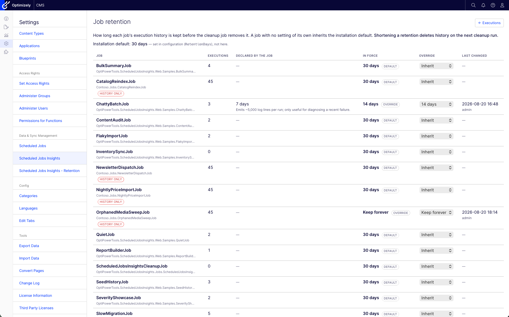

# OptiPowerTools.ScheduledJobsInsights

[](https://sonarcloud.io/summary/new_code?id=szolkowski_OptiPowerTools.ScheduledJobsInsights)
[](https://sonarcloud.io/summary/new_code?id=szolkowski_OptiPowerTools.ScheduledJobsInsights)
[](https://sonarcloud.io/summary/new_code?id=szolkowski_OptiPowerTools.ScheduledJobsInsights)
[](https://sonarcloud.io/summary/new_code?id=szolkowski_OptiPowerTools.ScheduledJobsInsights)

Execution history for **native Optimizely CMS 13 scheduled jobs**. Swap `EPiServer.Scheduler.ScheduledJobBase` for `LoggedScheduledJobBase` and every run is recorded: each `OnStatusChanged` message, the job's return value, unhandled exceptions, severity-tagged log lines, an optional multi-line result summary, and automatic metrics (duration, allocations, CPU time, GC counts) — persisted to EF Core-backed SQL tables, browsable in a paginated list and console-style log viewer embedded in the CMS admin, and aged out by an automatic retention cleanup job.

Part of the [OptiPowerTools](https://github.com/szolkowski) family — see also [OptiPowerTools.Hangfire](https://github.com/szolkowski/OptiPowerTools.Hangfire) if your background jobs run on Hangfire instead of (or alongside) Optimizely's native scheduler.

## Features

- One-liner DI bootstrap: `services.AddOptiPowerToolsScheduledJobsInsights()`.
- `LoggedScheduledJobBase` — a drop-in replacement for `ScheduledJobBase` that captures execution history automatically.
- Per-run log lines with severity/color (`Default`/`Info`/`Success`/`Warning`/`Error`/`Debug`), plus a dedicated `LogInputData` call for capturing what a run started with.
- Automatic execution metrics (duration, allocated bytes, CPU time, GC generation counts) and a `RecordMetric` API for custom domain metrics.
- An optional per-run **result summary** — a multi-line report the job builds as it works, shown in its own collapsible section of the detail view, separate from the one-line message Optimizely shows in its admin grid.
- Paginated, filterable Blazor execution list and a console-style scrolling log viewer for a single run, embedded in the CMS shell like any native admin page.
- Menu entries in the CMS's own navigation — including one under **Settings › Data & Sync Management**, beside the native **Scheduled Jobs** page — and links from the UI across to a job's CMS settings.
- Automatic retention cleanup — itself a native `[ScheduledJob]`, visible and manageable in the CMS's own Scheduled Jobs admin list. It also resolves runs abandoned by a recycled process, which would otherwise sit at *Running* for ever.
- Per-job retention, including indefinite: declare it on the job with `[JobRetention]`, or set it per job in a CMS screen that shows what each job declared and why.
- Unhandled exceptions are never swallowed — native CMS admin's `HasLastExecutionFailed`/`LastExecutionMessage` tracking is completely unaffected.
- Cannot take your site down: if the insights database is unreachable, the application still starts, jobs still run, and `OnStatusChanged` still drives the CMS status column — only the history is lost, and it says so in the log.
- Authorization by Optimizely role out of the box, or by an authorization policy of your own — applied as ordinary endpoint metadata, so the page, the retention screen and the menu entries can never disagree about who may see them.
- Configurable via `IOptions<T>` or `appsettings.json`, validated at startup so a misconfiguration fails there rather than silently once jobs are running.

## Screenshots

**Execution list** — filterable and keyset-paginated, with status badges, a **summary** marker on runs that recorded one, and a link across to the CMS's own Scheduled Jobs page:


**Execution detail** — result summary, metrics, input data and stack trace in collapsible sections, above a console-style log viewer with severity colouring, a line count and jump controls. Shown here for a failed run, whose summary survives the exception:


**Result summary** — a multi-line report the job builds as it works, newlines and alignment intact, with a copy button:


**Job Retention overview** — the list covers every job deriving from LoggedScheduledJobBase — so a job can be configured before its first run — plus every job type that only exists in history, so records left behind by deleted code can still be trimmed. Those rows are marked history only.



## Quick Start

### Install

```bash
dotnet add package OptiPowerTools.ScheduledJobsInsights
```

### Package sources

The package itself is on nuget.org, but its Optimizely dependencies are not — they come from
Optimizely's own feed, which any CMS project already has configured:

```xml
<add key="Optimizely" value="https://api.nuget.optimizely.com/v3/index.json" />
```

### Required project setting

Add this to the application's `.csproj` before anything else:

```xml
<PropertyGroup>
  <RequiresAspNetWebAssets>true</RequiresAspNetWebAssets>
</PropertyGroup>
```

The UI is a Blazor Server component, so the application has to serve `_framework/blazor.server.js`.
That file comes from the `Microsoft.AspNetCore.App.Internal.Assets` pack, which the Web SDK
references only when the *application project itself* contains `.razor` files — this package's
components live in the package, so the SDK does not notice. Without the setting the page renders but
never becomes interactive, and the browser console shows a 404 for `blazor.server.js`.

Applications that already contain their own `.razor` files get it automatically and can skip this.

### Wiring it up

```csharp
// Program.cs or Startup.cs
services.AddOptiPowerToolsScheduledJobsInsights(options =>
{
    options.ConnectionString = Configuration.GetConnectionString("EPiServerDB");
});

// ... then in the middleware pipeline, after UseAuthorization()
// and BEFORE your own UseEndpoints(...) / MapXxx calls
app.UseOptiPowerToolsScheduledJobsInsights();

app.UseEndpoints(endpoints =>
{
    endpoints.MapContent();
    endpoints.MapControllers();
});
```

Connection string can point to the same database as Optimizely or to a separate one — there is no fallback, it must be set explicitly.

> `UseOptiPowerToolsScheduledJobsInsights()` applies pending migrations and maps the Blazor Server hub
> the UI connects over. Call it after `UseAuthorization()`; placing it ahead of your own
> `UseEndpoints(...)` keeps the hub registered alongside everything else. It deliberately does **not**
> call `MapControllers()` — your application already does, and mapping controllers from two separate
> `UseEndpoints(...)` blocks registers every action twice, which fails at request time with
> `AmbiguousMatchException`.

### Writing a logged job

Derive from `LoggedScheduledJobBase` and implement `ExecuteJob()` instead of the usual `Execute()`:

```csharp
using EPiServer.Scheduler;
using OptiPowerTools.ScheduledJobsInsights.Configuration;
using OptiPowerTools.ScheduledJobsInsights.Logging;

[ScheduledJob(DisplayName = "Nightly Catalog Sync", IntervalType = ScheduledIntervalType.Days)]
public class CatalogSyncJob : LoggedScheduledJobBase
{
    public CatalogSyncJob(JobLoggingContext context)
        : base(context)
    {
    }

    protected override string ExecuteJob()
    {
        LogInputData(new { Source = "ERP", Mode = "Incremental" });

        Log("Starting catalog sync.");
        // ... do the work, calling OnStatusChanged(...) as usual if you like ...
        Log("42 products updated, 1 skipped.", LogSeverity.Warning);

        RecordMetric("ProductsUpdated", 42);

        Summary.AppendSection("Totals");
        Summary.AppendLine("  Updated : 42");
        Summary.AppendLine("  Skipped : 1");

        return "Synced 42 products.";
    }
}
```

- `Execute()` is sealed — the wrapper always runs, so implement `ExecuteJob()` instead.
- Every `OnStatusChanged(...)` call you make is captured automatically, in addition to the native event.
- If `ExecuteJob()` throws, the exception is recorded (message, stack trace) and then rethrown unchanged — native CMS admin's failure tracking behaves exactly as it would without this package.
- Constructor parameters are resolved via DI, the same way Optimizely already constructs every `ScheduledJobBase` — add your own alongside `JobLoggingContext` and forward only the context to `base`.
- **Stoppable jobs**: set `IsStoppable = true` in your constructor and check `IsStopRequested` between units of work. A run that ends after a stop request is recorded as **Stopped** rather than as a success, so the history says what actually happened.

### Result summary

`Summary` is an optional multi-line report for the run. It is not the same thing as the string
`ExecuteJob()` returns:

| | where it shows | shape |
|---|---|---|
| the returned `string` | Optimizely's **Last execution message**, one cell of the CMS admin grid, *and* the Result line here | keep it to one sentence |
| `Summary` | the **Result summary** section of the execution detail view | as many lines as you need |

Nothing is written unless you append something, so jobs that do not use it pay nothing.

```csharp
Summary.AppendLine($"Export for {from:yyyy-MM-dd} … {to:yyyy-MM-dd}");

Summary.AppendSection("Rows by region");        // underlined heading, blank line before it
foreach (var region in regions)
    Summary.AppendLine($"  {region.Name,-6} {region.Rows,6:N0}");

Summary.AppendSection("Totals");
Summary.AppendLine($"  Rows exported : {total:N0}");
```

`Append`, `AppendLine`, and `AppendSection` all return the summary, so a line built from parts can be
chained: `Summary.Append("  ").Append(name).AppendLine(count.ToString())`.

- **Newlines are preserved** end to end — stored as written, rendered as written.
- **It survives failure.** The summary is persisted on the way out of `ExecuteJob()` whether it
  returned or threw, so whatever a failing job managed to record is still on the page.
- **It is bounded.** Appends past `MaxResultSummaryLength` (100,000 characters by default) are
  discarded and the stored text ends with a truncation notice — a job appending one line per
  processed row cannot write megabytes into every execution row. `Summary.IsTruncated` tells you
  whether that happened.
- **It is safe to append to from parallel tasks**, like `Log`.
- `SetSummary("…")` replaces the whole thing at once, for jobs that already hold the finished text.
- `FlushSummary()` persists it mid-run. Only needed for a long job that wants its summary visible in
  the detail view while it is still running; otherwise the automatic flush at the end is enough.

Code that records an execution without being a scheduled job at all can call
`IJobExecutionWriter.SetResultSummary(executionId, text)` directly — the same bound applies.

## Viewing logs

The CMS menu item opens a paginated execution list — job name, status, start time, duration, result —
with filters for job and status, and a link across to the CMS's own **Scheduled Jobs** page.

### Execution statuses

| | |
|---|---|
| **Running** | Started, no outcome reported yet. |
| **Succeeded** | `ExecuteJob()` returned without throwing. |
| **Failed** | It threw. The message and stack trace are recorded, and the exception is rethrown unchanged. |
| **Stopped** | An administrator pressed Stop and the job noticed — see [Writing a logged job](#writing-a-logged-job). Distinct from Succeeded: the work was cut short. |
| **Interrupted** | No outcome was ever reported and the run has been given up on: the process was recycled, the container replaced, or the host crashed mid-job. Applied retrospectively by the cleanup job after `InterruptedExecutionThreshold`, because a process that dies mid-run cannot record anything itself. The completion time stays empty — it is genuinely unknown. |

The last two exist so the history says what actually happened. Without them a stopped job reads as a
success and an abandoned one sits at *Running* for ever, quietly distorting every count and filter.

**Timestamps are shown in your own time zone**, stated above the table and suffixed with the offset
on the detail page (`2026-08-19 17:37:16 UTC+02:00`). The browser's IANA zone is recorded in a
`sji-timezone` cookie by the page itself and applied server-side, so it survives prerendering rather
than flickering into place after the circuit connects. Two consequences worth knowing:

### Watching a job that is still running

A still-running execution polls every two seconds and appends new lines live, marked with a **live**
indicator; only lines newer than those already shown are fetched, so following a long run stays cheap.

Leave that page open and the run finishes underneath you, and the page catches up on its own — no
reload. The status badge flips, the duration and completion time fill in, and any section that did
not exist yet appears: **Metrics** (the automatic ones are only recorded as the job ends) and
**Result summary**, if the job wrote one without checkpointing it. Because log lines and metrics go
through the buffered writer while completion is written straight through, the page reads once more a
moment after the run ends, so the last batch of both lands too.

| Severity | Color |
|---|---|
| `Info` | Blue |
| `Success` | Green |
| `Warning` | Yellow |
| `Error` | Red |
| `Debug` | Gray |
| `Default` | Neutral |


## Automatic metrics

Recorded for every execution, alongside anything you record yourself via `RecordMetric`:

| Metric | Notes |
|---|---|
| `DurationMs` | Wall-clock time around `ExecuteJob()`. Always reliable — one dedicated thread per execution. |
| `AllocatedBytes` | Thread-scoped allocation delta. Precise — the strongest automatic signal. |
| `CpuTimeMs` | Process-wide CPU time delta. Noisy under concurrent job execution; most meaningful for longer-running jobs. |
| `GcGen0Collections` / `GcGen1Collections` / `GcGen2Collections` | Process-wide GC collection count deltas. Same concurrency caveat as CPU time, but still a useful trend signal across repeated runs of the same job. |

## Configuration

### Code configuration

```csharp
services.AddOptiPowerToolsScheduledJobsInsights(options =>
{
    // Required
    options.ConnectionString = "Server=.;Database=MyDb;Trusted_Connection=True;";

    // Optional — all values below are the defaults
    options.AutoMigrateDatabase = true;
    options.RetentionDays = 30;
    options.CleanupBatchSize = 500;

    options.LogChannelCapacity = 10_000;
    options.LogBatchSize = 100;
    options.LogFlushInterval = TimeSpan.FromMilliseconds(500);

    options.PageSize = 50;

    options.PageTitle = "Scheduled Jobs Insights";
    options.AuthorizedRoles = ["Administrators", "CmsAdmins", "WebAdmins"];
    // Authorization: roles by default. Name a policy of your own with options.AuthorizationPolicy,
    // or set options.AllowAnyAuthenticatedUser if access is already restricted elsewhere.
    options.EnableCmsMenu = true;
    options.MenuPlacement = CmsMenuPlacement.CmsSection;
    options.MenuPath = null;
    options.MenuSortIndex = null;
    options.CustomSectionName = "OptiPowerTools";
    options.CustomMenuItemName = string.Empty;
    options.ShowInDataSyncManagement = true;
    options.CmsShellPath = "/ScheduledJobsInsightsCms/Index";
});
```

### appsettings.json

```json
{
  "OptiPowerTools": {
    "ScheduledJobsInsights": {
      "ConnectionString": "Server=.;Database=MyDb;Trusted_Connection=True;",
      "AutoMigrateDatabase": true,
      "RetentionDays": 30,
      "CleanupBatchSize": 500,
      "LogChannelCapacity": 10000,
      "LogBatchSize": 100,
      "LogFlushInterval": "00:00:00.500",
      "PageSize": 50,
      "MaxResultSummaryLength": 100000,
      "PageTitle": "Scheduled Jobs Insights",
      "AuthorizedRoles": ["Administrators", "CmsAdmins", "WebAdmins"],

      "EnableCmsMenu": true,
      "MenuPlacement": "CmsSection",
      "ShowInDataSyncManagement": true,
      "CustomSectionName": "OptiPowerTools",
      "CmsShellPath": "/ScheduledJobsInsightsCms/Index"
    }
  }
}
```

Code overrides configuration when both are used.

### Options reference

| Option | Type | Default | Description |
| ------ | ---- | ------- | ----------- |
| `ConnectionString` | `string` | `""` | **Required.** SQL Server connection string for job execution/log/metric storage. |
| `AutoMigrateDatabase` | `bool` | `true` | Apply pending EF Core migrations automatically at startup. |
| `MaxLogMessageLength` | `int` | `4000` | Longest log message stored; longer ones are truncated with an ellipsis. The column itself is unbounded, so this is what stops a job that logs a response body per iteration writing megabytes per row. |
| `MaxLogEntriesPerExecution` | `int` | `20000` | Most log lines the detail page reads *and holds* for one execution. A Blazor circuit holds every line it is given for as long as the page is open, so this is a server-side memory bound, once per viewer — and it bounds the total across all the polls of a running job, not just one read. A longer log is displayed truncated, with a notice above it saying so. |
| `DetailPollInterval` | `TimeSpan` | `00:00:02` | How often the detail page re-reads an execution that is still running. One query per open page per interval, so it scales with viewers rather than with history; each tick reads a narrow projection plus any new log lines, not the whole row. |
| `ConfigureDbContext` | `Action<DbContextOptionsBuilder>?` | `null` | Applied to the insights `DbContext` after its connection string, for what this package does not decide: `EnableRetryOnFailure()`, a command timeout, a connection interceptor, a managed-identity token provider. Code-only — a delegate cannot come from `appsettings.json`. |
| `AddBlazorServices` | `bool` | `true` | Whether to register Blazor Server and cascading authentication state. Set to `false` when the host registers Blazor itself — its registrations must be equivalent, or the retention screen loses the authorization re-check it makes before a destructive write. The service-side counterpart to `MapBlazorHub`. |
| `InterruptedExecutionThreshold` | `TimeSpan` | `24:00:00` | How long a run may sit unfinished before the cleanup job records it as **Interrupted**. `TimeSpan.Zero` disables the sweep. |
| `RetentionDays` | `int` | `30` | How many days of execution history to keep for jobs with no rule of their own. Enforced by the cleanup job; overridden per job by `[JobRetention]` or the retention screen. `0` or less means keep indefinitely. |
| `CleanupBatchSize` | `int` | `500` | Max executions deleted per batch by the cleanup job. |
| `LogChannelCapacity` | `int` | `10000` | Capacity of the in-memory buffer for log/metric writes before falling back to a synchronous insert. |
| `LogBatchSize` | `int` | `100` | Max buffered records flushed to the database per batch. |
| `LogFlushInterval` | `TimeSpan` | `00:00:00.5` | Max time buffered records wait before being flushed, even if `LogBatchSize` isn't reached. |
| `PageSize` | `int` | `50` | Executions shown per page in the Blazor list. |
| `MaxResultSummaryLength` | `int` | `100000` | Character limit for an execution's result summary. Appends past it are discarded and the stored text ends with a truncation notice. Values of zero or less fall back to the default. |
| `PageTitle` | `string` | `"Scheduled Jobs Insights"` | Title shown in the CMS shell chrome and browser tab. |
| `AuthorizedRoles` | `IList<string>` | `["Administrators", "CmsAdmins", "WebAdmins"]` | Optimizely roles allowed to reach the page, the retention screen and the menu entries. Ignored when `AuthorizationPolicy` or `AllowAnyAuthenticatedUser` is set. |
| `AuthorizationPolicy` | `string?` | `null` | Name of an authorization policy **you** registered, used instead of the role check. Startup fails with a named error if no such policy exists. |
| `AllowAnyAuthenticatedUser` | `bool` | `false` | Drops the role check entirely. ⚠️ On a site with front-end membership, "authenticated" includes ordinary visitors — who could then read execution history and any captured input data. |
| `MapBlazorHub` | `bool?` | `null` | Whether `UseOptiPowerToolsScheduledJobsInsights` maps the Blazor hub. `null` detects an existing `/_blazor` mapping and skips its own. |
| `EnableCmsMenu` | `bool` | `true` | Add a menu item to the Optimizely CMS navigation. |
| `MenuPlacement` | `CmsMenuPlacement` | `CmsSection` | Where the menu item appears: `CmsSection`, `TopLevel`, or `CustomSection`. |
| `MenuPath` | `string?` | `null` | Overrides the auto-derived menu path. |
| `MenuSortIndex` | `int?` | `null` | Overrides the auto-derived sort index. |
| `CustomSectionName` | `string` | `"OptiPowerTools"` | Section name for `TopLevel`/`CustomSection` placement. |
| `CustomMenuItemName` | `string` | *(empty)* | Overrides the menu item label; falls back to `PageTitle`. |
| `ShowInDataSyncManagement` | `bool` | `true` | Also adds an entry under **Settings › Data & Sync Management**, directly below the CMS's own **Scheduled Jobs** page. Independent of `MenuPlacement` — see below. |
| `ShowRetentionMenuItem` | `bool` | `true` | Adds a menu entry for the **Job Retention** screen beside the insights one. The screen stays reachable at `?view=retention` either way. |
| `CmsShellPath` | `string` | `"/ScheduledJobsInsightsCms/Index"` | URL path where the UI is served. A single execution is addressed with an `id` query string, e.g. `/ScheduledJobsInsightsCms/Index?id=42`. |

### Data & Sync Management entry

By default the UI is reachable from two places. `MenuPlacement` positions the primary entry, and
`ShowInDataSyncManagement` adds a second one inside the CMS's own admin tree, immediately below the
native **Scheduled Jobs** page:

```
Settings
  Data & Sync Management
    Scheduled Jobs             (Optimizely's own)
    Scheduled Jobs Insights    (this package)
```

That is where an administrator looking at a job tends to look for its history, so it is on by
default. The two settings are independent; set `ShowInDataSyncManagement` to `false` for a single
menu entry positioned solely by `MenuPlacement`.

### Menu Placement

Same three placement modes as the rest of the OptiPowerTools family:

#### `CmsSection` (default)

Nests the menu item under the existing CMS section.

#### `TopLevel`

```json
{ "OptiPowerTools": { "ScheduledJobsInsights": { "MenuPlacement": "TopLevel" } } }
```

Places the menu item directly in the global navigation bar.

#### `CustomSection`

```json
{
  "OptiPowerTools": {
    "ScheduledJobsInsights": {
      "MenuPlacement": "CustomSection",
      "CustomSectionName": "Background Jobs"
    }
  }
}
```

Creates a new collapsible section and nests the item underneath it.

## When the insights database is unavailable

This package observes scheduled jobs; it is never allowed to prevent them. If its database cannot be
reached:

- **The application still starts.** Startup migrations log a critical error and continue rather than
  aborting `Configure`, which would otherwise stop the whole CMS from booting.
- **Jobs still run, and still report correctly.** `BeginExecution` returns null, recording is skipped
  for that run, and everything else behaves normally — including rethrowing a job's own exception, so
  Optimizely's success/failure tracking is unchanged.
- **The CMS status column still updates**, because `OnStatusChanged` raises the native event before
  any recording is attempted.
- **Nothing throws into job code.** No member of `IJobExecutionWriter` throws, and neither does
  anything around it. `LogInputData` survives anything the object you hand it can do — an object graph
  JSON cannot serialize (a cycle through an EF navigation), *and* a property getter that throws on
  access (a lazy-loading proxy whose `DbContext` is gone, a computed `IContent` property). Either way
  the run records why the input could not be captured and carries on. The automatic metrics are
  captured and recorded defensively too, so a counter this package cannot read costs a metric rather
  than the run, and a metrics failure can no longer report a successful job as failed, nor replace the
  job's own exception with its own.

What you lose is the execution history for the affected period. The UI itself needs the database to
show anything, so it reports that it could not read the history rather than rendering an empty list —
and rather than dropping the CMS's own circuit-error bar over the page.

## Database & migrations

Tables live in a fixed SQL Server schema (`scheduled_jobs_insights`) via standard EF Core Migrations — there is no `SchemaName` option, so the schema location is not runtime-configurable.

### Applying the schema

By default the package applies pending migrations at startup. If the application's identity has no
DDL rights set `AutoMigrateDatabase = false` and apply the schema yourself.

**Every release ships an idempotent SQL script** for exactly this, attached to the
[GitHub release](https://github.com/szolkowski/OptiPowerTools.ScheduledJobsInsights/releases) as
`scheduled-jobs-insights-<version>.sql`. Run it with any tool you like; it is safe to re-run against a
database at any migration level, including one that is already current:

```bash
sqlcmd -S <server> -d <database> -i scheduled-jobs-insights-1.0.0.sql
```

That script is the supported route for a consuming application. The `dotnet ef` command below works
only inside a checkout of *this* repository, because `ScheduledJobsInsightsDbContext` and its
design-time factory are `internal`:

```bash
dotnet ef database update \
  --project src/OptiPowerTools.ScheduledJobsInsights \
  --context OptiPowerTools.ScheduledJobsInsights.Data.ScheduledJobsInsightsDbContext
```

No `--startup-project` is needed — `Data/ScheduledJobsInsightsDbContextFactory` is a design-time
`IDesignTimeDbContextFactory`, so the library serves as its own startup project. (Passing the `.Web`
host instead fails: `Microsoft.EntityFrameworkCore.Design` is a `PrivateAssets="All"` reference of the
library and does not flow to it.)

## Retention

How long each job's execution history is kept, resolved in this order:

| | set by | wins over |
|---|---|---|
| **1. Override** | an administrator, in the **Job Retention** screen | everything |
| **2. `[JobRetention]`** | the job's own code | the default |
| **3. `RetentionDays`** | configuration (default 30) | — |

Any of the three can be **indefinite**, meaning the cleanup job skips that history entirely.

### Declaring retention on a job

```csharp
[ScheduledJob(DisplayName = "Nightly Catalog Sync", IntervalType = ScheduledIntervalType.Days)]
[JobRetention(7, Description = "Logs one line per SKU; a week is enough to diagnose a bad run.")]
public class CatalogSyncJob : LoggedScheduledJobBase { }
```

Use `JobRetentionAttribute.Indefinite` to keep a job's history forever. The attribute travels with the
code, so a fresh deployment gets it right without anyone remembering to configure anything — but it is
a *default*, not a mandate: an administrator can still override it.

The `Description` is shown beside the value in the retention screen, so whoever is deciding whether to
override it can see what the job's author intended and why.

### The Job Retention screen

Reached from the **Retention** link on the execution list, or from its own entry under **Settings ›
Data & Sync Management**. For every job it shows the declared value and its rationale, what is
actually in force and where that came from, how many executions are currently stored, and who last
changed the setting.

The list covers every job deriving from `LoggedScheduledJobBase` — so a job can be configured before
its first run — plus every job type that only exists in history, so records left behind by deleted
code can still be trimmed. Those rows are marked **history only**.

Jobs on Optimizely's own `ScheduledJobBase` are deliberately absent: they never write execution
history, so there is nothing to retain, and listing the CMS's two dozen built-ins would bury the
handful that matter.

Choosing a value saves it straight away — there is no Save button, so there is no half-applied state.
*Inherit* clears the override, letting the attribute or the default apply again.

Changes take effect on the next run of the cleanup job. Nothing is deleted at the moment you save.

## Cleanup job

`ScheduledJobsInsightsCleanupJob` is auto-discovered into the CMS's own Scheduled Jobs admin list, like any other native job. It deletes executions (and their cascade-deleted logs/metrics) in batches of `CleanupBatchSize`, and reports what it removed as its execution message.

Each run does three passes:

1. **Give up on abandoned runs.** Executions still `Running` since longer ago than
   `InterruptedExecutionThreshold` are recorded as **Interrupted**. A process recycled mid-run writes
   nothing further, so nothing else would ever finish those rows — and until they are resolved, every
   count and status filter is wrong. `CompletedAt` stays empty: the end time is genuinely unknown.
2. **The default sweep** — everything older than `RetentionDays`, *excluding* every job type that has a retention of its own. Jobs with their own rule are skipped whether that rule is shorter or longer than the default, so the default can never delete history a job explicitly asked to keep.
3. **One pass per governed job type**, each against its own cutoff. Job types set to indefinite are skipped entirely.

After installation, the job's run interval and enabled/disabled state are managed from the CMS Scheduled Jobs screen, not from options — `RetentionDays`/`CleanupBatchSize` are the only settings that keep working post-install. The job is itself a `LoggedScheduledJobBase`, so its own runs appear in the execution list like any other.

### If your application already uses Blazor

`UseOptiPowerToolsScheduledJobsInsights` maps the Blazor Server hub the UI connects over. Mapping
`/_blazor` twice puts two endpoints on one route pattern and every Blazor request in the application
then fails with `AmbiguousMatchException` — with nothing in the message naming this package.

By default it detects an existing mapping and skips its own, so most hosts need do nothing. Set
`MapBlazorHub` explicitly if yours maps its hub **after** this call, which detection cannot see:

```csharp
options.MapBlazorHub = false;   // your application owns /_blazor
```

Note the hub this package maps carries its authorization policy. A hub the host already mapped is
left exactly as the host configured it.

## Removing this package

Unlike a fully self-contained storage layer, this package owns its own SQL Server tables. Removing it stops new executions from being recorded and drops the cleanup job from the CMS's Scheduled Jobs list, but existing `scheduled_jobs_insights.*` tables and their data are left in place until you drop them manually.

## Development

The solution includes a `.Web` project that references the [MyOptiAlloySite](https://github.com/szolkowski/MyOptiAlloySite) Optimizely CMS 13 site via a git submodule for manual testing. The site runs against SQL Server in Docker.

### Prerequisites

- .NET SDK 10.0
- Docker Desktop (SQL Server for the dev site)
- Git with submodule support

> On Apple Silicon, note that `mcr.microsoft.com/mssql/server` is published for `linux/amd64` only.
> The `db` service pins `platform: linux/amd64` and runs emulated, which is why its healthcheck
> allows a generous start period. No action needed — just expect a slower first start.

### Build and test

The library and its tests build on their own — no submodule, Docker or database required:

```bash
dotnet build src/OptiPowerTools.ScheduledJobsInsights/OptiPowerTools.ScheduledJobsInsights.csproj
dotnet test tests/OptiPowerTools.ScheduledJobsInsights.Tests/OptiPowerTools.ScheduledJobsInsights.Tests.csproj
```

Building the full solution additionally needs the submodule checked out:

```bash
git submodule update --init --recursive
dotnet build
```

`TreatWarningsAsErrors` is on repo-wide, and the library generates XML documentation — every public
or protected member needs a doc comment or the build fails with CS1591.

### Setup

```bash
git clone --recursive https://github.com/szolkowski/OptiPowerTools.ScheduledJobsInsights.git
cd OptiPowerTools.ScheduledJobsInsights
cp .env.example .env   # or edit in place
```

`.env` holds the local SQL Server password, the database name and the host ports:

| Variable | Default | Purpose |
| --- | --- | --- |
| `SA_PASSWORD` | `Episerver123!` | `sa` password inside `sjinsights-db` |
| `DB_NAME` | `ScheduledJobsInsights` | Created on first start by the container entrypoint |
| `WEB_HOST_PORT` | `5103` | Host port for the site |
| `DB_HOST_PORT` | `6003` | Host port for SQL Server |

The ports avoid the ranges used by the sibling `OptiPowerTools.Hangfire` and MyOptiAlloySite stacks,
so all of them can run at once.

### Seed the Alloy content

`App_Data/` is gitignored in the submodule, so a fresh clone has **no** CMS content. Optimizely
imports `App_Data/DefaultSiteContent.episerverdata` automatically into an empty database and creates
the site definition from it. Without that file the CMS still starts and the admin UI works, but there
is no content and no site definition, so `/` returns 404.

Copy it in from any existing MyOptiAlloySite checkout before the first start:

```bash
mkdir -p sub/MyOptiAlloySite/MyOptiAlloySite/App_Data
cp /path/to/MyOptiAlloySite/App_Data/DefaultSiteContent.episerverdata \
   sub/MyOptiAlloySite/MyOptiAlloySite/App_Data/
```

If the site is already running, `docker compose restart web` triggers the import.

### Run via Docker

```bash
docker compose up -d                 # db + web
docker compose up db -d              # just SQL Server
docker compose logs web -f           # follow web logs
docker compose stop                  # stop, keeping the database
docker compose down                  # remove containers; the database volume survives
docker compose down -v               # also delete the database
```

The database lives in the named volume `sjinsights-sqldata` and persists across `down` and Docker
Desktop restarts. Only `down -v` discards it.

| What | Where |
| --- | --- |
| Site | `http://localhost:5103` |
| CMS back office | `http://localhost:5103/Optimizely/CMS/` |
| First-run admin registration | `http://localhost:5103/util/register` |
| Scheduled Jobs Insights | CMS menu item, or `http://localhost:5103/ScheduledJobsInsightsCms/Index` |
| SQL Server | `localhost,6003` — user `sa` |

> On CMS 13 the back office is at `/Optimizely/CMS/`. The CMS 11/12 path `/episerver` returns a bare
> 404 with no redirect.

On a brand-new database there are no users, so visit `/util/register` first and create the
administrator account. Until then the back office is unreachable. The registration page is only
served while no user exists — once the account is created it returns 404, which is expected.

### Run the web host locally

```bash
docker compose up db -d
dotnet run --project src/OptiPowerTools.ScheduledJobsInsights.Web
```

Then open `https://localhost:5001`, log in, and click the CMS menu item.
`appsettings.Development.json` points at `localhost,6003`, so this shares the same containerised
database as the Docker web service — run one or the other, not both against the same data.

### Sample jobs

The `.Web` project includes sample jobs in `Samples/`. These are not part of the NuGet package — they
exist purely to exercise the package's features manually. Between them they cover every logging API
and every state the two UI pages can render.

| Job | What it demonstrates |
| --- | --- |
| `InventorySyncJob` | Multi-phase logging at `Info`/`Success`/`Warning` severities. |
| `ReportBuilderJob` | Building a `Summary` up as the work happens — sections, a per-region breakdown and totals — alongside `LogInputData` and custom `RecordMetric` calls. |
| `FlakyImportJob` | Throws on alternating runs — proves a failure still surfaces correctly in both native CMS admin and this package's UI, and that the summary recorded before the throw is still persisted. |
| `ChattyBatchJob` | Emits ~5,000 log lines in a tight loop — exercises the buffered writer and the virtualized log viewer under load. Also the worked example for `[JobRetention]`, since it is exactly the kind of job that warrants a shorter one. |
| `StatusReportingJob` | `OnStatusChanged` — drives the CMS's live status column and is captured as `LogEntrySource.StatusChanged` lines, interleaved with ordinary `Log` calls. |
| `SlowMigrationJob` | Runs for ~60s so an execution can be watched mid-flight: the `Running` badge, the detail page's 2s polling, the `—` duration, and the seconds duration format. Builds a summary but never flushes it, so the whole **Result summary** section appears on the tick after the job completes. Sets `IsStoppable` and checks `IsStopRequested` between batches, so stopping it mid-run records the execution as **Stopped**. |
| `SeverityShowcaseJob` | One line at every `LogSeverity`, so the console renders the complete colour and label set. |
| `QuietJob` | Logs nothing at all — what an unmodified job looks like after only changing its base class, and the detail page's empty-log state. |
| `ContentAuditJob` | Constructor DI — takes an `IContentLoader` beyond the two parameters the base class needs. |
| `SeedHistoryJob` | Uses the public `IJobExecutionWriter` directly to write ~60 synthetic executions, giving the list enough volume to test keyset paging and the filters. Half of them carry a result summary; one is left permanently `Running`. Also shows the one-shot `SetSummary`. |
| `SummaryShowcaseJob` | Writes long lines past the 100,000-character limit — exercises wrapping and the truncation notice — and checkpoints with `FlushSummary()` so the summary fills in live while the job runs. |
| `BulkSummaryJob` | The volume case: ~2,000 short lines (~55 KB) that fit inside the limit, so the whole report survives. Exercises the summary pane's scrolling and the auto-collapse that keeps a report this long from burying the log. |

All are disabled by default (`DefaultEnabled = false`); enable and trigger them manually from the CMS's Scheduled Jobs admin page.

> The Optimizely scheduler is disabled in Development by the Alloy site's own startup, so jobs never
> fire on their interval in this dev host. Use **Start Manually** in the Scheduled Jobs admin page —
> that still runs the job through `LoggedScheduledJobBase` and records the execution.

### Running tests

```bash
dotnet test
```

Tests run against `net10.0`.

### Project structure

| Project | Purpose |
| ------- | ------- |
| `src/OptiPowerTools.ScheduledJobsInsights` | The NuGet library package. |
| `src/OptiPowerTools.ScheduledJobsInsights.Web` | Dev site for manual testing (references the MyOptiAlloySite submodule). |
| `tests/OptiPowerTools.ScheduledJobsInsights.Tests` | Unit tests — xUnit + NSubstitute, Sqlite in-memory for EF Core-dependent tests, bUnit for the Blazor pages. |
| `sub/MyOptiAlloySite` | Git submodule — [szolkowski/MyOptiAlloySite](https://github.com/szolkowski/MyOptiAlloySite) (Optimizely CMS 13 Alloy site). |

## Compatibility

| Package version | .NET | Optimizely CMS |
|---|---|---|
| 1.x | 10.0 | 13.x |

## License

[MIT](LICENSE.txt) — see `LICENSE.txt`.

## Contributing

See [CONTRIBUTING.md](CONTRIBUTING.md).
